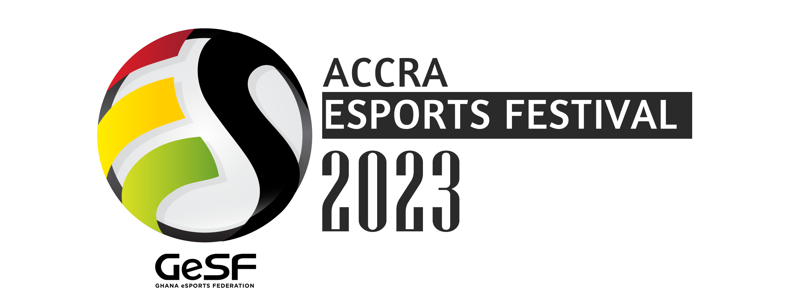

# 

<a name="readme-top"></a>


<div align="center">

  
  <br/>
   <br/>

  <h1><b>🕹️🕹️ ACCRA ESPORTS FESTIVAL 🎮🏆🎮</b></h1>

</div>

<!-- TABLE OF CONTENTS -->

# 📗 Table of Contents

- [📖 About the Project](#about-project)
  - [🛠 Built With](#built-with)
    - [Tech Stack](#tech-stack)
    - [Key Features](#key-features)
- [💻 Getting Started](#getting-started)
  - [Setup](#setup)
  - [Prerequisites](#prerequisites)
  - [Usage](#usage)
- [👥 Authors](#authors)
- [🤝 Contributing](#contributing)
- [⭐️ Show your support](#support)
- [🙏 Acknowledgements](#acknowledgements)
- [📝 License](#license)

<br>

<!-- DEPLOYMENT -->
### This project goes live [here](https://frempongdev.github.io/Accra-Esports-Festival/) 🚀 .
If link does not work copy URL ( https://frempongdev.github.io/Accra-Esports-Festival/ )

<br>

<!-- DEPLOYMENT -->
### Have a look at the project's video presentation [here](https://www.loom.com/share/1f7de2b9345a4d3988c6327952899d30) 📽️ .

<br>

<!-- PROJECT DESCRIPTION -->

# 📖 [Accra Esports Festival] <a name="about-project"></a>


**Accra Esports Festival** is a project for an annual Esports event held in Ghana. The project comsists all essential information aboout the event and can even be used to book tickets. 

## 🛠 Built With <a name="built-with"></a>

### Tech Stack <a name="tech-stack"></a>

<details>
  <summary>HTML</summary>
  <ul>
    <li><a href="https://developer.mozilla.org/en-US/docs/Web/HTML">Link to HTML</a></li>
  </ul>
</details>

<details>
  <summary>CSS</summary>
  <ul>
    <li><a href="https://developer.mozilla.org/en-US/docs/Web/CSS">Link to CSS</a></li>
  </ul>
</details>

<details>
  <summary>Javascript</summary>
  <ul>
    <li><a href="https://www.javascript.com/">Link to Javascript</a></li>
  </ul>
</details>


<!-- Features -->

### Key Features <a name="key-features"></a>


- **This Project has a Readme.md file**
- **This Project has a gitignore file**
- **This projects uses all Microverse Linters to check errors**
- **This project gives details about the Esports festival in Accra, its date, time and location**
- **This project gives opportunity for participants to book a ticket for the event**
- **This project has links to various Video game power houses in Ghana**
- **This project lists various activities to be done during the event**


<p align="right">(<a href="#readme-top">back to top</a>)</p>

<!-- GETTING STARTED -->

## 💻 Getting Started <a name="getting-started"></a>


To get a local copy up and running, follow these steps.

### Prerequisites

In order to run this project you need to copy the link of this Repository.


```sh
 https://github.com/frempongdev/Accra-Esports-Festival.git
```
<br>

### Setup

Clone this repository to your desired directory using the command: 


```sh
  cd your-folder
  git clone https://github.com/frempongdev/Accra-Esports-Festival.git 
```

<br>


### Usage

Kindly go ahead and give this project a massage but do not forget to give a detailed description in your pull request.

<!--
Example command:

```sh
  rails server
```
--->


<p align="right">(<a href="#readme-top">back to top</a>)</p>


<!-- AUTHORS -->
### 👥 Frempong
## 👥 Author <a name="authors"></a>
### 👥 Frempong

- GitHub: [@frempongdev](https://github.com/frempongdev)
- Twitter: [@knobaddy](https://twitter.com/knobaddy)
- LinkedIn: [Samuel knower Amankwaa-Frempong](https://www.linkedin.com/in/frempongdev/)

<p align="right">(<a href="#readme-top">back to top</a>)</p>


## 🔭 Future Features <a name="future-features"></a>


- [ ] **[Tickets Page to Join event]**
- [ ] **[Accommodation Booking Page for travellers]**
- [ ] **[Individual Event Activity Pages]**
- [ ] **[Sponsor Page]**
- [ ] **[News Page for various Ghanaian Gaming events newa]**
- [ ] **[Multi-Language implementation for page]**
- [ ] **[E-Campaign Page for a gaming campaign]**
- [ ] **[Sign In Page for users to keep unique user details]**
- [ ] **[Link addresses for various speakers of the event]**


<p align="right">(<a href="#readme-top">back to top</a>)</p>

<!-- CONTRIBUTING -->
## :handshake: Contributing <a name="contributing"></a>
Contributions, issues, and feature requests are welcome!
Feel free to check the [issues page](../../issues/).

<p align="right">(<a href="#readme-top">back to top</a>)</p>
<!-- SUPPORT -->

## ⭐️ Show your support <a name="support"></a>


If you like this project kindly support by suggesting changed by forking and pull requests

<p align="right">(<a href="#readme-top">back to top</a>)</p>

<!-- ACKNOWLEDGEMENTS -->

## 🙏 Acknowledgments <a name="acknowledgements"></a>

I would like to thank  everyone who inspired me to learn programming. Regards to the whole Microverse team, Peers, and family supporting. <br>A massive Thank You to [Cindy Shin](https://www.behance.net/adagio07) who is the original designer of this [design](https://www.behance.net/gallery/29845175/CC-Global-Summit-2015)

<p align="right">(<a href="#readme-top">back to top</a>)</p>

<!-- LICENSE -->

## 📝 License <a name="license"></a>

This project is [MIT](./LICENSE) licensed.

<p align="right">(<a href="#readme-top">back to top</a>)</p>
